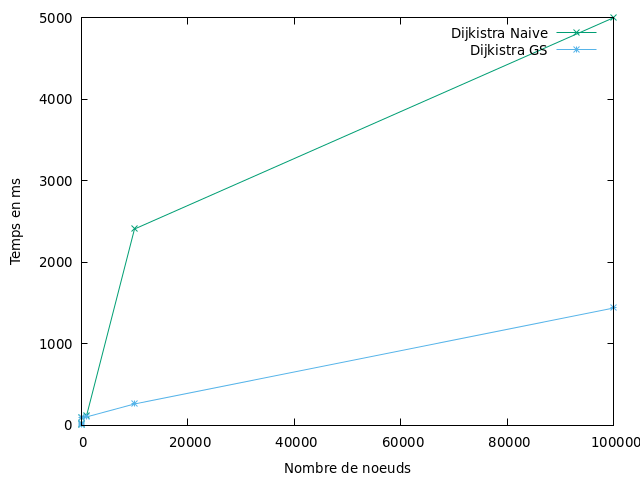

# Mamel Alboury NDIAYE, M1 info
#TP3 Graphe : Plus court Chemin 
#Encadrants : M. Baleve et M. Sanlaville

**_` Introduction :`_**

Dans ce TP, nous allons implémenter une méthode naive de l'algorithme de Dijkstra et faire une étude comparative avec celle de graphStream et en tirer des conclusions.
L'algorithme de Dijkstra est un algorithme à source unique. Il est utilisé pour trouver les chemins les plus courts à partir d'un noeud source vers les autres noeuds du  graphe.
Par exemple pour trouver le plus court chemin dans un réseau routier, l'algo de Dijkstra peut etre trés utile. 

**_`1- Objectif :`_**

Comme annoncé dans l'introduction, le but de ce Tp est d'implémenter une version naïve de l'algorithme de Dijkstra vu en cours, puis le lancer pour le tester en prenant soin de mesurer son temps d'exécution, en même temps, il faut lancer aussi l'algorithme de Dijkstra de GraphStream sur le même graphe en prenant soin de mesurer son temps d'exécution, puis comparer les résultats des deux Algorithmes ainsi que leurs temps d'exécution.

**_`2- Générateurs de graphes:`_**

Pour tester le programme, j'ai utilisé le Générateur de graphes aléatoires. Son but est de Générez des graphiques aléatoires de n'importe quelle taille nbNoeud et d’un degré moyen degreeMoyen. On instancie un objet de la classe Generator en spécifiant dans les paramètres du constructeur le degré moyen et le fait que le graphe soit dirigé. On appelle begin() qui crée un seul sommet, puis on appelle nextEvent() (nbNoeud fois ) qui ajoute à chaque appel un nouveau sommet au graphe. On finalise la création du graphe avec end().

On attribue des poids positifs aléatoires aux arêtes et on les affiche avec les identifiants des sommets sur le graphe. On colorie les sommets en rouge pour que ça soit lisible en cas d’affichage.

**_`3- Les méthodes de ma classe :`_**

_`A- public  void dijkstra(Graph g, Node s):`_ 

Cet algorithme nous permet de retourner les plus court chemin entre un noeud source vers tous les autres noeuds du graphe ainsi le plus court chemin entre un noeud source et un autre noeud quelconque du graphe.

Alors pour commencer j'ai crée une méthode dijkstra(graphe g , Node s) qui prend en paramètre notre graphe g ainsi le noeud source( noeud de départ de notre parcours). 

1- on initialise la distance de tous les noeuds du graphe a l'infini ainsi les parents de chaque noeud à null, pour se faire, j'ai parcouru tous les noeuds du graphe avec un forEach puis j'ai associé à chaque noeud sa distance à l'infini et son parent à null. 
g.nodes().forEach(n -> {
    n.setAttribute("distance", (int)Double.POSITIVE_INFINITY);
    n.setAttribute("parent", (Object) null);
});

2- La distance de notre noeud s va prendre la valeur 0 en la mettant à jour avec s.setAttribute("distance",0);

3- J'ai créé une file de priorité qui stocke des objets de type Noeud, et elle fait la priorité selon la distance minimale de chaque noeud ajouté, c'est dans cette file que l'on va stocker à chaque fois les voisins d'un noeud (parent). PriorityQueue<Node> liste= new PriorityQueue<Node>(11, (a,b) -> (int)((int)a.getAttribute("distance") - (int)b.getAttribute("distance")));

4- On ajoute le noeud source s dans notre file.
Comme on récupère le noeud s dans une autre variable (Node u) en le supprimant de la file, on va chercher alors tous les voisins de ce noeud et on les ajoute dans notre file qui est vide actuellement (car on lui a supprimé le noeud s ), puis on va prendre dans la file le noeud qui a la distance minimale et on le stocke dans une autre variable v, on le supprime et on cherche ses voisins, on les ajoute dans notre file, on refait cette opération tant que notre file contient des noeuds, c'est-à-dire on a toujours des voisins jusqu'à ce que l'on arrive a un noeud qui ne contient pas de voisins (alors, on n'ajoute rien dans la file) et que la file soit vide complétement . => dans mon code : 

5- on boucle sur la file, tant qu'elle n'est pas vide. Dans cette boucle While on va récupérer dans notre file le noeud u qui contient la distance minimale, alors on utilise la fonction remove() de PriorityQueue qui retire la tête de notre file (comme notre file, elle place à chaque fois le minimum au début notre file selon les distances de chaque noeud ce qui implique alors que la tête de la file contient le noeud qui a la distance minimale).
5- une fois que l'on a récupéré le noeud u qui contient la distance minimale, on va alors récupérer toutes les arêtes sortantes de u en utilisant la fonction leavingEdges() de graphStream dans un Stream car la fonction leavingEdges() renvoie un Stream.

6- on crée un iterator sur notre Stream qui contient les arêtes sortantes du noeud u, dans le but de les parcourir et prendre le noeud v de direction (le noeud qui va avoir cette arête comme arête entrante ) en utilisant la fonction getTargetNode() de graphStream. Puis on fait une comparaison entre la distance de ce Noeud v  (voisin de u ) que l'on vient de prendre et la somme de la distance du Noeud u extrait auparavant dans notre file(c'est le noeud de départ (le parent de v) u ----> v) + le poid de l'arête sortante de u (courante dans lequel on a récupéré notre noeud de direction v ) (l'arête entre u et v). Alors si la distance du noeud d'arriver v (voisin de u ) est supérieur à la somme de la distance du noeud u et le poid de l'arête entre u ---> v  Alors on va mettre à jour la distance du voisin de U courant v(sa distance sera alors la somme de la distance du noeud u et le poids de l'arête entre u ---> v ) et aussi on associe u comme parent de v.

7- on vérifie si notre file contient le noeud v (si on est deja passé par ce noeud), si c'est le cas alors on ne l'ajoute pas une autre fois dans la file sinon on l'ajoute.

_`B- public  ArrayList plusCourtCheminDeMonAlgo(Graph g, Node s, Node t) :`_

Cette méthode retourne un ArrayList de Noeuds de notre plus court chemin entre deux noeuds passés en paramètre, un noeud source s et noeud d'arriver t. 
Au début, j'ai fait appel à notre méthode dijkstra (g,s) pour trouver le plus court chemin entre un noeud source s du graphe g et tous les autres noeuds du graphe dont le noeud t fait partie. Puis j'ai créé une ArrayList de Noeuds pour stocker les noeuds de notre plus court chemin. On vérifie si le noeud d'arriver contient un parent, si ce n'est pas le cas, alors, il n'existe pas de chemin entre le noeud source s et le noeud d'arriver t sinon on crée deux variables parent et n (ils sont comme des pivots )de type Node qui vont contenir notre noeud d'arriver t dans le but de ne pas modifier notre Noeud t et n'interagie qu'avec les variables (parent et n ) puis on ajoute le noeud t dans notre ArrayList (juste pour pouvoir l'afficher à la fin de notre chemin). On boucle sur notre Noeud d'arriver tant que l'on a pas encore atteint le noeud source, alors dans cette boucle on met à chaque fois à jour notre parent (au début le parent on l'a initialisé t, mais maintenant il devient le parent de n(n est initialisé t au début) puis n devient le parent pour que quand on revient au début de la boucle et que le parent n'est toujours pas le noeud source alors, parent prend le parent n jusqu'a ce que l'on ait parent comme noeud source, à chaque fois que l'on détermine le parent d'un noeud, on l'ajoute dans notre ArrayList. Une fois que l'on a obtenu notre chemin, la liste va nous afficher le chemin du sense inverse du noeud d'arriver vers le noeud source. Alors pour obtenir le chemin ordonné du noeud source au noeud d'arriver, on utilise Collection.reverse(notre Liste).

_`C- public ArrayList lesPlusCourtsCheminsDeMonAlgo(Graph g, Node s) :`_

Cette méthode permet de trouver les plus courts chemins entre le noeud source et tous les autres noeuds du graphe, elle nous renvoie un ArrayLIst de Noeuds de notre plus court chemin. On parcourt tous les noeuds du graphe, on les filtre sans le noeud source et alors on fait appel à la méthode qui renvoi le plus court chemin entre deux noeuds passer en paramètre. Donc cette méthode va prendre en paramètre notre graphe g, le noeud source s ainsi que le noeud n quelconque(tous les noeuds du graphe, celui renvoyer par le forEach) s'il n'existe pas de chemin entre le noeud source s et le noeud n alors on ne va pas l'ajouter dans notre ArrayList sinon on l'ajoute. Après avoir parcouru tous les noeuds du graphe, on retourne les plus courts chemins entre le noeud source et tous les autres noeuds du graphe dans une ArrayList.

**Algrithme de Djikstra de GraphStream :**

L'algorithme de Dijkstra est un algorithme qui trouve les plus courts chemins à partir d'un noeud source pour un graphe orienté avec des poids des arêtes positifs. Alors pour utiliser cette classe déjà présente dans GraphStream, j'ai commencé par : 

_`D- public Path PlusCourtCheminDijkstra(Graph g, Node s, Node t) :`_

Cette méthode renvoie le Path (chemin de type Path) entre notre noeud source s et notre noeud d'arriver t, alors j'ai défini une instance de Dijkstra avec les paramètres concernant le poids des arêtes de notre graphe puis on a initialisé le graph g avec la méthode init(g) de l'interface Algorithm, et j'ai mis à jour la source de notre objet Dijkstra avec notre Noeud source passer en paramétre, ainsi pour trouver les plus courts chemins on fait appel à la fonction compute() de l'interface Algorithm, finalement on retourne le chemin avec la fonction getPath(t=>(le noeud d'arriver)).

_`E- public ArrayList lesPlusCourtsCheminsDijkstra(Graph g, Node s) :`_

Cette méthode permet de retourner tous les plus courts chemins à partir d'un noeud source vers tous le reste des noeuds du graphe g dans une ArrayList de Path. Pour se faire, on parcourt tous les noeuds du graphe sans le noeud source puis on fait appel à notre méthode plusCourtChemin(g,s,n) qui trouve le plus court chemin entre un noeud source s et un autre noeud quelconque du graphe n renvoyé par notre forEach sur les noeuds du graphe, à chaque fois qu'il existe un chemin entre s et n, alors on ajoute ce chemin dans notre ArrayList sinon on ne l'ajoute pas (car lorsque qu'il n'y a pas de chemin entre une paire de noeuds, la méthode renvoit un Path vide (une liste vide)). A la fin on retourne notre ArrayList qui contient tous chemins à partir du noeud source s et tous le reste des noeuds du graphe.

**`4- Comparaison des temps d'éxècutions :`**

l'image se trouve dans (src/main/resources/comparaison.)

D'aprés le graphe et les données obtenus lors des tests, on peut voir que le temps d'exécution varie en fonction du nombre de noeuds (taille du graphe) et le degré moyen des arêtes (le nombre d'arêtes du graphe).
Dans ce cas, j'ai remarqué qu'à chaque fois que l'on augmente le nombre de noeuds du graphe et que le nombre d'arêtes du graphe est petit alors le temps d'exécution de l'algo que j'ai implémenté sera plus courte que celui de graphStream et chaque fois que l'on augmente le nombre d'arêtes et le nombres de noeuds, le temps d'exécution de la version de graphStream est plus court,
alors on peut en déduire que l'algo de Dijkstra de GraphStream est optimal lorsqu'on a un graphe de grande taille et beaucoup d'arêtes(un nombre important de relation entre les noeuds du graphe).
J'ai choisi ses valeurs pour les tests, par exemple pour le noeud 100 du graphe j'ai choisi différentes valeurs pour le degré moyen(valeurs très petites et grandes ) et de ce fait, j'ai pu en déduire que le temps d'exécution dépend du nombre de noeuds du graphe et le nombre d'arêtes qu'il contient.

**`Conclusion :`**

Le projet a été intéressant dans le fait de concevoir un algorithme et le fait de l'implémenter en java, il est basé sur le parcours en bfs. 
Comme vous le voyez, on a déduit que l'algorithme de Dijkstra est plus efficace pour trouver le plus court chemin et que sa complexité est d'ordre O(n²).
Ce tp m'a permis de mieux comprendre le fonctionnement de l'algorithme de Dijkstra et de découvrir celle de GraphStream. Il m'a aussi permis d'implémenter des lignes de codes à partir
d'un algorithme donné en cours, cette partie fut également la grande difficulté de ce tp.
